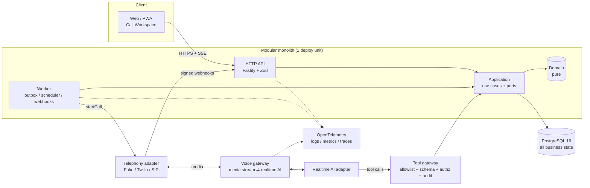
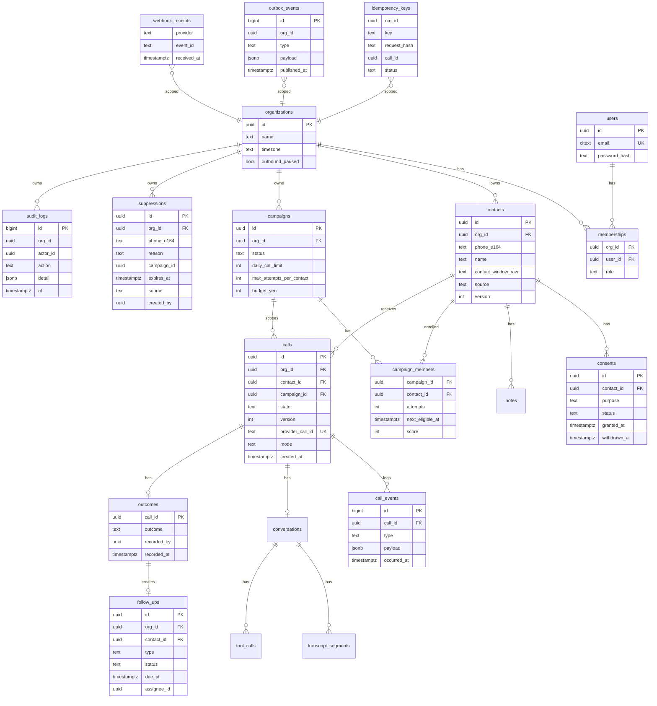

# ARCHITECTURE

## 方針

**Modular monolith**（1 デプロイ単位）+ 厳格なレイヤ分離。外部 Provider 境界（Telephony / AI / Storage / Email / Calendar）のみ抽象化し、それ以外の将来用抽象化は作らない。

```text
Interface      src/interface/   HTTP (Fastify), webhooks, (P9) UI
   ↓ depends on
Infrastructure src/infrastructure/  config, logging, (P2) Postgres repos, (P8/11) telephony adapters, (P12) AI adapters
   ↓
Application    src/application/  (P2+) use cases: gather facts → call domain → persist (+ outbox) in one transaction
   ↓
Domain         src/domain/       pure functions & types, no I/O, no framework (ESLint-enforced, ADR-0006)
```

## 現在のモジュール（Phase 0–1）

| Path                                  | 役割                                             |
| ------------------------------------- | ------------------------------------------------ |
| `domain/errors.ts`                    | Error taxonomy + retryable 分類                  |
| `domain/contact/phoneNumber.ts`       | 日本の電話番号 → E.164（DNC 照合キー）           |
| `domain/suppression/suppression.ts`   | DNC 等の suppression 判定（fail closed）         |
| `domain/compliance/callingWindow.ts`  | 発信可能時間帯（TZ・曜日・祝日・顧客希望）       |
| `domain/call/callStateMachine.ts`     | Call 状態機械                                    |
| `domain/outbound/outboundGuards.ts`   | 発信前 Guard Pipeline                            |
| `domain/outcome/outcome.ts`           | 通話結果 → Follow-up / Suppression               |
| `domain/conversation/conversation.ts` | AI 会話状態機械 + 拒否意図検知                   |
| `infrastructure/config.ts`            | env 検証・feature flags・client-safe 投影        |
| `infrastructure/logging/*`            | PII redaction 付き pino                          |
| `interface/http/app.ts`               | `/health`, `/config`, request id, error envelope |

## 発信フロー（P7 で実装予定の application 層の形）

```text
POST /calls (Idempotency-Key)
  └─ tx BEGIN
      ├─ idempotency key を INSERT … ON CONFLICT で予約（NEW / REPLAY / IN_FLIGHT / PAYLOAD_MISMATCH）
      ├─ contact / campaign / suppression / counters を SELECT … FOR UPDATE（contact 行ロックで二重発信防止）
      ├─ evaluateOutboundGuards(ctx)  ← Domain（純関数）
      ├─ ALLOW → call(QUEUED) INSERT + outbox(call.requested) INSERT
      └─ tx COMMIT
  outbox worker → TelephonyGateway.startCall()（Provider 呼び出しは tx の外。at-least-once + provider 側 idempotency）
```

- **Outbox pattern を採用予定**（ADR は P2 で確定）: DB 更新と外部発信の不整合（発信したのに記録が無い / 記録したのに発信しない）を防ぐ。
- Provider webhook は (provider, event id) で重複排除し、`transitionCall` で順序外れを INVALID_STATE_TRANSITION として吸収（no-op 記録）。

## Provider Adapter 境界（P8 / P11 / P12）

```ts
interface TelephonyGateway {
  startCall(input: StartCallInput): Promise<CallHandle>;
  transferCall(input: TransferCallInput): Promise<void>;
  endCall(input: EndCallInput): Promise<void>;
}
interface VoiceAgent {
  startSession(input: StartSessionInput): Promise<SessionHandle>;
  sendContext(input: SendContextInput): Promise<void>;
  requestHandoff(input: HandoffInput): Promise<void>;
  endSession(input: EndSessionInput): Promise<void>;
}
```

Domain は Provider 名・モデル名を知らない。Production adapter は公式ドキュメントの最新版を確認してから実装する（SDK メソッドを記憶で書かない）。

## Realtime

Call の realtime 状態は SSE を第一候補（一方向・HTTP/プロキシ互換・再接続容易）。双方向音声は Provider 側（SIP/WebRTC）に閉じる。P9 で ADR 化。

---

## Architecture Proposal（STEP 7, 2026-10-05）



- **Modular monolith を維持**（ADR-0003）。`apps/ + packages/` への分割は「独立デプロイが必要になった時」に再評価（ADR-0012）。現時点は `src/{domain,application,infrastructure,interface}` + lint 境界で同じ効果を得る。
- 会話状態を**プロセス内メモリに置かない**（現行 TAC の単一マシン固定制約を解消）。Call/Conversation は DB、音声セッションは voice gateway が保持し、切断時は Call を FAILED/ENDING に収束させる。
- 長時間処理（発信・webhook 後処理・自動フォロー）は worker が outbox から実行。HTTP リクエスト内で外部発信しない。

## Database ERD（STEP 9, P2 で migration 化）



主要制約・index（実クエリ基準）:

- `UNIQUE (org_id, phone_e164)` on contacts / `INDEX (org_id, phone_e164)` on suppressions（発信直前の照合）。
- `UNIQUE (org_id, key)` on idempotency_keys（同一 key の多重発信防止）。
- **部分一意 index** `calls (org_id, contact_id) WHERE state IN ('QUEUED','DIALING','RINGING','ANSWERED','AI_ACTIVE','HUMAN_ACTIVE','ENDING')` → 同一 contact への同時発信を DB で物理的に禁止（異なる idempotency key の競合も防ぐ。tac-next の既知課題への回答）。
- `UNIQUE (provider, event_id)` on webhook_receipts（重複 webhook）。
- `follow_ups (org_id, status, due_at)`、`calls (org_id, campaign_id, created_at)`、`outbox_events (published_at) WHERE published_at IS NULL`。
- 全テーブルに `org_id`。P3 で PostgreSQL RLS を併用するかを ADR で決める（アプリ層強制は必須、RLS は多層防御）。

## API Map（STEP 10）

全エンドポイント: 認証必須（`/health`・provider webhook を除く）、Zod 検証、`organization_id` はセッションから決定（パラメータで受け取らない）。

| Method          | Path                                                   | 用途                                                | 現行 TAC 対応                         | Phase    |
| --------------- | ------------------------------------------------------ | --------------------------------------------------- | ------------------------------------- | -------- |
| GET             | `/health`, `/config`                                   | 稼働確認 / client-safe 設定                         | —                                     | **DONE** |
| POST            | `/auth/login`, `/auth/logout`                          | セッション（HttpOnly cookie + CSRF）                | 共有トークン `X-TAC-Token`            | P3       |
| GET/POST        | `/contacts`, `/contacts/import`                        | 一覧・検索・並び替え / CSV 取込（正規化・重複排除） | `/tac/calls/queue`                    | P4       |
| GET/PATCH       | `/contacts/:id`                                        | 顧客詳細・タイムライン・分類修正                    | `/tac/follow`, `/tac/follow/correct`  | P4/P10   |
| GET/POST/DELETE | `/suppressions`                                        | DNC 一覧・手動登録・**権限＋理由付き**解除          | `/tac/dnc*`, 「連絡停止」             | P5       |
| GET/POST/PATCH  | `/campaigns`, `/campaigns/:id/pause`                   | キャンペーン・一時停止                              | —                                     | P6       |
| GET             | `/campaigns/:id/queue/next`                            | 次の1件（NBA 順、guard 済み）                       | `/tac/calls/ranked`, リスト           | P6       |
| POST            | `/calls` (`Idempotency-Key` 必須)                      | 発信要求 → guard → outbox                           | `/tac/call`                           | P7       |
| GET             | `/calls/:id`, `/calls/:id/events` (SSE)                | 通話状態のリアルタイム                              | —                                     | P7/P9    |
| POST            | `/calls/:id/takeover`, `/hangup`, `/transfer`, `/mute` | 通話操作                                            | —                                     | P9/P13   |
| POST            | `/calls/:id/outcome`                                   | 結果記録（→ follow-up / suppression）               | `/tac/calls/disposition`              | P10      |
| POST            | `/calls/:id/notes`                                     | メモ                                                | `/tac/calls/note`                     | P10      |
| GET/PATCH       | `/follow-ups`                                          | フォロー一覧（今日・期限超過）・完了・再調整        | `/tac/follow`, `/tac/calls/callbacks` | P10      |
| POST            | `/webhooks/telephony/:provider`                        | 署名検証 → 重複排除 → CallEvent                     | Twilio StatusCallback                 | P8/P11   |
| GET             | `/analytics/*`                                         | KPI・キャンペーン・担当者・時間帯                   | `/tac/calls/stats`, `/summary`        | P14      |
| POST            | `/admin/outbound/stop`, `/resume`                      | **STOP ALL OUTBOUND CALLS**（監査付き）             | autofollow toggle の一部              | P7       |
