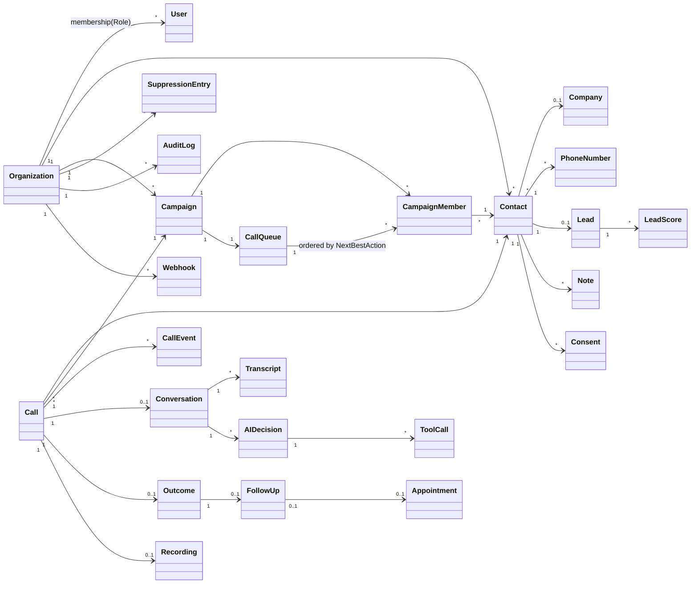
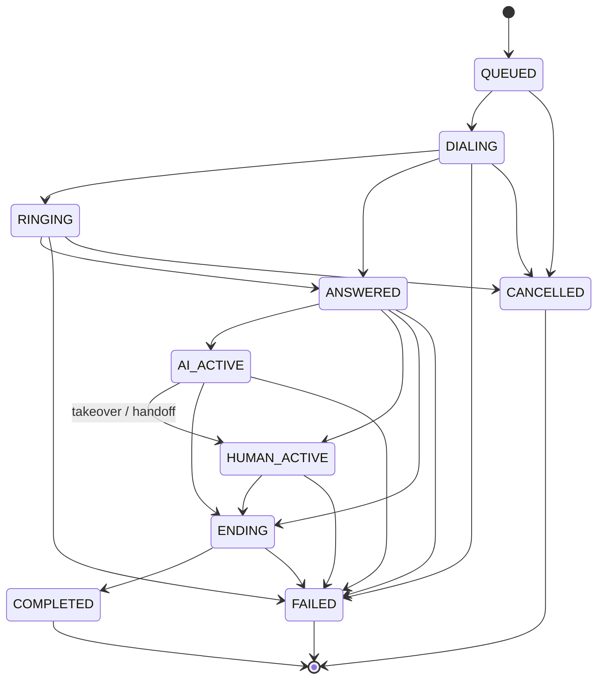
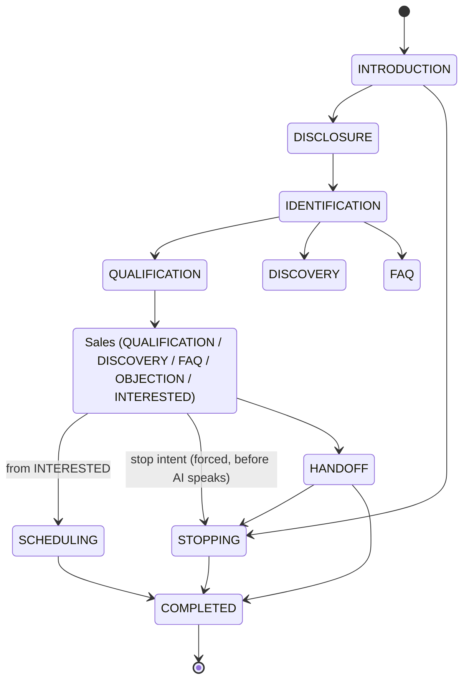

# DOMAIN

Domain は純関数のみ。期待される業務上の失敗は `Result`/判定値で返し、不変条件違反だけを `DomainError` で投げる。

## 優先順位（すべての判断に適用）

```text
Safety state (LEGAL_BLOCK > PRIVACY_BLOCK > DO_NOT_CALL > STOP_REQUESTED)
  > Compliance (calling window, consent, disclosure)
  > Operational limits (campaign, budget, concurrency, kill switch, provider)
  > Conversion
```

## 電話番号（`contact/phoneNumber.ts`）

- 入力揺れ（全角・ハイフン・括弧・空白・`+81`・`+81(0)`）→ **E.164 一意**。E.164 が dedupe / DNC 照合のキー。
- 携帯 `060/070/080/090` と IP `050` は 11 桁、固定は 10 桁。
- 発信対象外: `0120 / 0800 / 0570 / 0990 / 0180 / 020`、国外番号、`00` 国際プレフィックス。

## Suppression（`suppression/suppression.ts`）

| reason                                                     | 強さ         | 範囲             | 期限                                 |
| ---------------------------------------------------------- | ------------ | ---------------- | ------------------------------------ |
| LEGAL_BLOCK / PRIVACY_BLOCK / DO_NOT_CALL / STOP_REQUESTED | hard (BLOCK) | 常に組織全体     | **無期限**（expiresAt を無視）       |
| COOLDOWN                                                   | soft (BLOCK) | campaign or 組織 | expiresAt で失効（未設定は有効扱い） |
| HUMAN_REQUIRED                                             | HUMAN_REVIEW | 組織             | —                                    |

- lookup 失敗 = `SUPPRESSION_UNAVAILABLE` で BLOCK。未知 reason / 不正形状 = `SUPPRESSION_DATA_INVALID` で BLOCK。
- **override 引数は存在しない**。hard block を解除できるのは P5 の「権限 + 監査付きの suppression 削除」だけ。

## 発信可能時間（`compliance/callingWindow.ts`）

- 組織ポリシー（既定 Asia/Tokyo 09:00–20:00, 月–土, 祝日リスト）× 顧客希望時間帯の **AND**。顧客希望は狭めるだけで広げない。
- ポリシー不正・未知 TZ は `POLICY_INVALID` で全拒否。顧客希望の文字列が解釈不能なら希望は無視（組織ポリシーは適用）。

## Call 状態機械（`call/callStateMachine.ts`）

```text
QUEUED → DIALING → RINGING → ANSWERED → AI_ACTIVE → HUMAN_ACTIVE → ENDING → COMPLETED
   └→ CANCELLED   └→ ANSWERED  └→ FAILED/CANCELLED   └→ HUMAN_ACTIVE / ENDING / FAILED
```

- 終端: COMPLETED / FAILED / CANCELLED（どこにも遷移不可）。自己遷移は不可（重複イベントは上位で no-op）。
- `HUMAN_ACTIVE → AI_ACTIVE` 不可（人の引き継ぎは確定）。遷移ごとに `version + 1`（楽観ロック用）。

## 発信前 Guard Pipeline（`outbound/outboundGuards.ts`）

```text
AUTHENTICATION → AUTHORIZATION → TENANT → IDEMPOTENCY → KILL_SWITCH → CONTACT → PHONE
→ SUPPRESSION → CONSENT → CALLING_WINDOW → CAMPAIGN_LIMITS → BUDGET → CONCURRENCY → TELEPHONY
```

- 最初の失敗で停止し、通過した guard の `trace` を返す（監査ログ用）。guard が例外を投げたら `INTERNAL_ERROR/GUARD_ERROR` で DENY。
- `AI_AGENT` actor は権限に関係なく発信不可。cross-tenant は `NOT_FOUND`（存在を漏らさない）。
- IDEMPOTENCY を TENANT 直後に置く理由は ADR-0008。REPLAY は発信しない。
- 予算不明（null）は DENY。concurrency は「同一 contact の通話中」を CONFLICT で拒否（二重発信防止の domain 側ルール。DB 側ロックは P6/P7）。

## Outcome → Follow-up（`outcome/outcome.ts`）

| Outcome                           | Suppression                   | Follow-up                              |
| --------------------------------- | ----------------------------- | -------------------------------------- |
| APPOINTMENT_SET                   | —                             | APPOINTMENT @appointmentAt（未来必須） |
| CALLBACK_REQUESTED                | —                             | CALLBACK @callbackAt（未来必須）       |
| NOT_REACHED_NO_ANSWER / VOICEMAIL | —                             | RETRY +24h（上限到達で無し）           |
| NOT_REACHED_BUSY                  | —                             | RETRY +30min（同上）                   |
| NOT_INTERESTED                    | STOP_REQUESTED                | 無し                                   |
| REFUSED_DO_NOT_CALL               | DO_NOT_CALL                   | 無し                                   |
| WRONG_NUMBER                      | PRIVACY_BLOCK（第三者の番号） | DATA_FIX（社内タスク）                 |
| CONVERSATION_ENDED_NO_RESULT      | —                             | 無し                                   |

- 既存 hard suppression があれば営業 follow-up は作らない（DATA_FIX のみ可）。
- outcome は COMPLETED / FAILED の call にだけ、1 回だけ記録可能。FAILED は NOT_REACHED_* のみ。

## AI 会話状態機械（`conversation/conversation.ts`）

```text
INTRODUCTION → DISCLOSURE → IDENTIFICATION → {QUALIFICATION, DISCOVERY, FAQ, OBJECTION, INTERESTED} → SCHEDULING
任意の進行中状態 → HANDOFF | STOPPING | COMPLETED
HANDOFF → STOPPING | COMPLETED,   STOPPING → COMPLETED のみ
```

- DISCLOSURE（商号・氏名・勧誘目的の告知）を経ずに営業状態へ入れない。
- `handleCustomerTurn` は **AI が応答する前に** 毎発話で実行。拒否検知で STOPPING を強制し、
  `PERSIST_SUPPRESSION → CONFIRM_STOP → END_CALL` を指示。AI に説得のターンは渡らない。
- 拒否検知は過検知を許容（false positive = 1 会話の終了、false negative = 拒否者への勧誘継続）。
  「〜で結構です」（肯定）は除外。

---

## Domain Model（STEP 6, 2026-10-05）

凡例: **[IMPL]** Phase 1 で純関数として実装済み / **[P2+]** 永続化・アプリ層で実装予定 / **[PROPOSED]** 次世代版の新規提案。



| Entity                        | 責務 / 不変条件                                                                        | 状態                       |
| ----------------------------- | -------------------------------------------------------------------------------------- | -------------------------- |
| Organization                  | テナント境界。全エンティティは `organization_id` を持ち、跨ぐ参照は不可                | P3                         |
| User / Role                   | `OWNER / ADMIN / MANAGER / OPERATOR / VIEWER`（+ 非人間 actor `AI_AGENT`, `SYSTEM`）   | P3（actor 種別は IMPL）    |
| Contact / PhoneNumber         | 電話番号は E.164 で一意（org 内）。TAC 台帳の「お客様」                                | normalize IMPL / 永続化 P4 |
| Company                       | 法人顧客（任意）                                                                       | P4                         |
| Lead / LeadScore              | 獲得経路・属性・温度感。スコアは**説明可能**（要因と重み）。TAC の score / 温度 を置換 | PROPOSED P6                |
| Campaign / CampaignMember     | 発信目的・時間帯・上限・予算。TAC の「スマートリスト」= campaign の動的セグメント      | P6                         |
| CallQueue                     | 次に掛ける相手の順序。DNC/同意/時間帯/上限をキュー投入時と**発信直前の両方**で評価     | P6                         |
| Call / CallEvent              | 状態機械（下記）。provider webhook は CallEvent として追記し重複排除                   | SM IMPL / 永続化 P7        |
| Conversation / Transcript     | AI/人の会話。Transcript は PII 扱い（保持期間ポリシー）                                | SM IMPL / P12              |
| Outcome                       | TAC の 成約/検討/折り返し/不在/拒否 を拡張した語彙（DOMAIN 上部参照）                  | IMPL                       |
| FollowUp / Task / Appointment | TAC の フォロー台帳（再調整希望/日程返答待ち/不在/要確認/連絡停止）を置換              | rule IMPL / P10            |
| Note                          | 通話メモ。untrusted text（AI にはデータとして渡す）                                    | P10                        |
| SuppressionEntry              | DNC 等。hard は無期限・org 全体・削除は権限＋監査のみ                                  | rule IMPL / P5             |
| Consent                       | 目的別（`AI_VOICE_OUTBOUND`, `RECORDING`, …）・取得経路・撤回日時                      | P5                         |
| Recording                     | `RECORDING_ENABLED` かつ告知済みのみ。保持期間で削除                                   | P12                        |
| AIDecision / ToolCall         | AI の判断と tool 呼び出しの監査証跡（入力は検証済み、出力は sanitize 済み）            | P12                        |
| AuditLog                      | 誰が・いつ・何を（DNC 登録/解除、kill switch、権限変更、分類修正）                     | P3/P5                      |
| Webhook                       | 受信 webhook の (provider, event_id) 重複排除台帳                                      | P8                         |

### Policy（AI に任せず Domain で判定する）

| Policy                            | 実装                                                                                 |
| --------------------------------- | ------------------------------------------------------------------------------------ |
| SuppressionPolicy                 | `suppression/suppression.ts` **[IMPL]**                                              |
| CallingWindowPolicy               | `compliance/callingWindow.ts` **[IMPL]**                                             |
| ConsentPolicy                     | guard `CONSENT`（WITHDRAWN 拒否）**[IMPL]**。目的別同意（AI 音声は同意必須）**[P5]** |
| DisclosurePolicy                  | 会話状態機械で DISCLOSURE 必須 **[IMPL]**、文言テンプレートの版管理 **[P12]**        |
| CompliancePolicy                  | Guard pipeline 全体 **[IMPL]**                                                       |
| RecordingPolicy / RetentionPolicy | **[P12 / P16]**                                                                      |

## Safety State（STEP 8 の一部）

通常状態より常に優先。優先度順（上ほど強い）:

| Safety state                    | 契機                                                     | 効果                                                             | 状態                           |
| ------------------------------- | -------------------------------------------------------- | ---------------------------------------------------------------- | ------------------------------ |
| LEGAL_BLOCK                     | 法務判断・行政指導                                       | 全発信禁止（無期限）                                             | IMPL（suppression）            |
| PRIVACY_REQUEST / PRIVACY_BLOCK | 利用停止・削除請求、第三者番号                           | 発信禁止＋データ処理（P16）                                      | IMPL（PRIVACY_BLOCK）          |
| DO_NOT_CALL                     | 「電話しないで」「連絡不要」、TAC の「拒否」、IVR DTMF 9 | 無期限 suppression                                               | IMPL                           |
| STOP_REQUESTED                  | 「結構です」「興味ない」                                 | 無期限 suppression（再勧誘禁止）                                 | IMPL                           |
| COMPLAINT                       | クレーム検知（`detectComplaint`）                        | AI 停止 → HANDOFF + FLAG_COMPLAINT。拒否を伴えば STOPPING が優先 | IMPL（Phase 1 delta）          |
| HUMAN_REQUIRED                  | 低信頼度・センシティブ・高額案件                         | 自動発信停止、人のレビュー                                       | IMPL（HUMAN_REVIEW）           |
| SYSTEM_FAILURE                  | AI/Provider 障害                                         | AI 停止 → 人へ or 丁寧に終話                                     | **NOT IMPLEMENTED（P12/P13）** |

## Call State Machine（Mermaid）



禁止遷移の代表: 終端から任意 / `HUMAN_ACTIVE → AI_ACTIVE` / 自己遷移 / `QUEUED → ANSWERED`（DIALING を飛ばす）。
Provider の busy / no-answer / voicemail は `FAILED` + Outcome `NOT_REACHED_*` で表現。順序外れ webhook は P8 で「既に後の状態なら no-op 記録」。

## Conversation State Machine（Mermaid）



`PERMISSION`（「今お時間よろしいですか」）は Phase 1 delta で追加済み: DISCLOSURE → PERMISSION → IDENTIFICATION（図では簡略のため省略）。PERMISSION での拒否は STOPPING。Human takeover 後は `canAiSpeak` が常に false（`takeOver` は不可逆で、resumeAi は存在しない）。

## Provider webhook の調停（`call/reconcile.ts`, IMPL）

`reconcileProviderEvent(call, status)` は、重複を DUPLICATE、後退を STALE、終端後を TERMINAL として無視する。欠けた中間状態は合法な遷移で補完する（例: QUEUED に answered → DIALING→ANSWERED）。未応答の completed は FAILED。

## 現行 TAC との写像（`outcome/tacMapping.ts`, IMPL）

5 ボタン: 成約→WON / 検討→CONSIDERING（+3 日で FOLLOW_UP）/ 折り返し→CALLBACK_REQUESTED / 不在→NOT_REACHED_NO_ANSWER / 拒否→REFUSED_DO_NOT_CALL。フォロー分類: 再調整希望→CALLBACK / 日程返答待ち→FOLLOW_UP / 不在→RETRY / 要確認→HUMAN_REVIEW / 連絡停止→STOP_REQUESTED。未知ラベルは推測せず拒否する。
