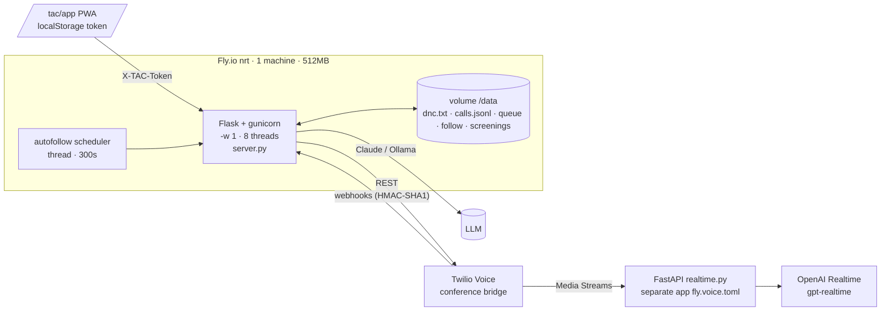
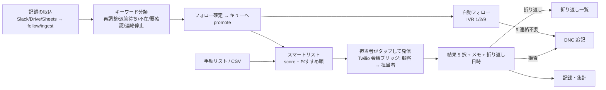

# EXISTING_APP_AUDIT — 現行 TAC（さくら発信 / 自動フォロー）監査

監査日: 2026-10-05。目的: 現行 TAC が支えている営業 Workflow を理解し、次世代版で **何を残し・直し・置き換え・やめ・足すか** を証拠付きで決める。UI の模倣は目的にしない。

## 0. 証拠と分類

| 区分         | 意味                                         |
| ------------ | -------------------------------------------- |
| **OBSERVED** | ソースコードで確認した事実（file:line 付き） |
| **INFERRED** | コードと文書からの合理的推定                 |
| **UNKNOWN**  | 確認不能                                     |
| **PROPOSED** | 次世代版の新規提案                           |

- 参照 URL `https://tac-martial-arts.fly.dev/tac/app` は開発環境の egress で**到達不可**（2026-10-04/05 とも 403）。画面・HTTP・XHR・Service Worker の**実機観察はできていない**。
- 代わりに、TAC のソース `hasegawa212/-6780` の `telegram-ai-bot/tac/` を読んだ。`fly.toml` に `app = "tac-martial-arts"` があり、本番 URL と一致する（OBSERVED: `tac/fly.toml:7,30`）。
  - `main`（`b76c0f5`）: 4 タブ版「さくら発信」（発信 / リスト / 記録 / 設定）。
  - **`feature/sakura-max`（`e61a665`, 2026-10-05）**: 5 タブ版「自動フォロー」。スマートリスト・フォロー台帳・顧客詳細・分類修正・自動フォロー架電エンジンを含む。**本書の主対象**。
- **UNKNOWN**: 本番に今デプロイされているのがどちらのブランチか。DB・ログ・実データの中身。
- 依頼文の機能リスト（連絡予定・再調整・要確認・対応済み 等）は sakura-max の UI と一致した。依頼文に書かれていたこと自体は事実として扱っていない。
- 同じリポジトリの `tac-next/` に別系統の次世代版がある。`tac-next/docs/EXISTING_APP_AUDIT.md` は `main` しか見ておらず、sakura-max 側の機能を UNKNOWN 扱いにしている。本書はその穴を埋める（§9）。

## 1. 構成（OBSERVED）

- 1 プロセス固定。会話状態はメモリ上にあるので、水平スケールできない（`tac/README.md`「ワーカーは 1 プロセス固定」、`fly.toml:43`）。
- 永続化は JSON / JSONL ファイル。DB はない（`config.py:79-91,147`）。

## 2. 画面（OBSERVED: `tac/mobile_app.py` @ sakura-max）

| タブ / 画面    | 要素                                                                                                                                                                                                                                                                                                  | 根拠                                 |
| -------------- | ----------------------------------------------------------------------------------------------------------------------------------------------------------------------------------------------------------------------------------------------------------------------------------------------------- | ------------------------------------ |
| 📞 発信        | 番号入力、担当者選択（既定「自動で振り分け」）、発信ボタン、結果 5 ボタン（成約/検討/折り返し/不在/**拒否**=赤）。折り返しを選ぶと日時ピッカー。メモ欄                                                                                                                                                | `:340-360`, `DISPOSITIONS` `:19`     |
| 📋 リスト      | **スマートリスト**: サーバーのキューを検索し、スコア順・名前順・**おすすめ順**（`/tac/calls/ranked`、温度・分類付き）で並べる。タップで発信画面に番号を入れる。**手動リスト**: textarea に番号を並べ、localStorage に保存して 1 件ずつ発信・スキップ。**連続モード**（記録の 0.5 秒後に次を自動発信） | `:367-395`, `:664-666`, `:1182-1187` |
| 🔁 フォロー    | 「今日のフォロー」。件数カード（📅連絡予定 / 🔁再調整希望 / ❗要確認 / ✅対応済み）、分類フィルタ、顧客カード一覧。**自動フォローエンジン**（ON / 一時停止 / OFF、次の 1 件と判定根拠、プレビュー、1 件発信、**「▶ 連続で自動発信（止まらない）」**、**「無人オート運転」**）                         | `:427-489`, `:459-468`               |
| 顧客詳細シート | 名前・分類バッジ・電話・担当、タイムライン、出典、主アクション、**分類を修正**（5 分類）、**連絡停止にする**                                                                                                                                                                                          | `:493-520`, `:994`                   |
| 📊 記録        | 合計件数、ステータス別の件数、発信 / 成約 / 成約率、担当者別チャート、折り返し一覧、直近記録（AI インサイト・温度付き）                                                                                                                                                                               | `:400-422`, `:1128-1145`             |
| ⚙️ 設定        | 操作者トークン（`TAC_OUTBOUND_TOKEN`）を localStorage に保存                                                                                                                                                                                                                                          | `:524-531`                           |
| PWA            | manifest（standalone、`scope:/tac/`、アイコン 192/512）。**Service Worker なし**（オフライン不可）                                                                                                                                                                                                    | `:23-41`                             |

- 表示はすべて `textContent`（XSS 対策として良い）。重要操作（拒否・1 件発信・連続発信・自動運転・分類修正・連絡停止）には `confirm()` がある。
- Loading は「発信中…」程度。Empty state は「おすすめの発信先がありません」。Error state は `msg.bad` の 1 行表示。

## 3. API（OBSERVED: `tac/server.py`。要約）

- **操作者 API**（共有トークン。`hmac.compare_digest` 比較、query `?token=` も受け付ける）:
  - 発信系: `POST /tac/call`
  - 通話記録系: `/tac/calls`, `/tac/calls.csv`, `/tac/calls/{queue,disposition,note,callbacks,stats,summary,insight,ranked}`
  - フォロー系: `/tac/follow{,/ingest,/correct,/promote}`, `/tac/autofollow/{status,toggle,run,run-batch}`
  - 管理系: `/tac/dnc`, `/tac/agents`, `/tac/console`
- **Twilio webhook**（HMAC-SHA1。env で ON/OFF でき、既定は OFF、本番は ON）: `/tac/voice*`, `/tac/message`, `/tac/recording-status`, `/tac/amd-status`, `/tac/autofollow/{dtmf,call-status}`。
- **認証なし**: `/tac/assist/<sid>`, `/tac/insights`, `POST /tac/close/<sid>`, WS `/tac/relay`, realtime サービス全体（`/tac/voice-stream`, WS `/tac/media-stream`）（`server.py:206-224,871`, `realtime.py:243-303`）。

## 4. 現行の業務 Workflow（INFERRED from code）

## 5. Feature Inventory（依頼された調査対象との対応）

| 機能                                            | 現行の振る舞い                                                                                                                                                                | 証拠                                                      |
| ----------------------------------------------- | ----------------------------------------------------------------------------------------------------------------------------------------------------------------------------- | --------------------------------------------------------- |
| 発信                                            | 1 タップで 1 件発信。顧客に掛け、出たら担当者に掛けて会議でつなぐ                                                                                                             | OBSERVED `outbound.py:141-230`                            |
| 担当者選択                                      | 名簿から選ぶか round-robin。**`+` 始まりなら任意の番号を担当者として受け付ける**                                                                                              | OBSERVED `agents.py:59-60`                                |
| 電話番号                                        | NFKC、先頭 0 → +81、8〜15 桁                                                                                                                                                  | OBSERVED `phone.py:17-41`                                 |
| 通話結果                                        | 成約・検討・折り返し・不在・拒否（自由文字列として保存）                                                                                                                      | OBSERVED `mobile_app.py:19`, `disposition.py`             |
| 成約                                            | 通知 webhook を送り、集計に入る                                                                                                                                               | OBSERVED `disposition.py:50`, `stats.py:48`               |
| 検討                                            | 特別な処理なし（記録のみ）                                                                                                                                                    | OBSERVED                                                  |
| 折り返し                                        | `callback_at` を記録して一覧に出す。**完了状態がない**                                                                                                                        | OBSERVED `callbacks.py`                                   |
| 不在                                            | 記録のみ。自動フォローでは「不在」分類が再架電対象                                                                                                                            | OBSERVED                                                  |
| 拒否                                            | DNC に自動登録（確認ダイアログあり）                                                                                                                                          | OBSERVED `disposition.py:33-37`                           |
| メモ                                            | calllog に `status=note` で追記                                                                                                                                               | OBSERVED `notes.py`                                       |
| 発信禁止                                        | `dnc.txt`（全体で 1 ファイル）。API で追加・**削除**でき、監査記録なし                                                                                                        | OBSERVED `dnc.py`, `server.py:813-830`                    |
| 顧客詳細                                        | フォロー台帳 1 件分の詳細とタイムライン                                                                                                                                       | OBSERVED `mobile_app.py:493-520`                          |
| 履歴                                            | 直近 20 件、CSV エクスポート                                                                                                                                                  | OBSERVED                                                  |
| 分類修正                                        | 5 分類から手で選び直す                                                                                                                                                        | OBSERVED `/tac/follow/correct`                            |
| スマートリスト                                  | `queue.json` を検索・並び替え。おすすめ順は分類スコア＋鮮度ボーナス                                                                                                           | OBSERVED `queue.py`, `server.py:741-764`                  |
| 手動リスト                                      | localStorage の番号列。サーバー側に状態はない                                                                                                                                 | OBSERVED                                                  |
| 検索 / 並び替え                                 | 名前・エリア・番号の部分一致 / スコア・名前・おすすめ                                                                                                                         | OBSERVED                                                  |
| スキップ                                        | 手動リストの位置を進めるだけ（理由は記録しない）                                                                                                                              | OBSERVED                                                  |
| 連続処理                                        | 手動リストの連続モード、自動フォローの連続発信・無人運転                                                                                                                      | OBSERVED                                                  |
| フォロー: 連絡予定 / 再調整 / 要確認 / 対応済み | UI の件数カード。バックエンドの分類は 再調整希望 / 日程返答待ち / 不在 / 要確認 / 連絡停止。**「連絡予定」「対応済み」はバックエンドに分類として存在しない**（UI 側の集計名） | OBSERVED `followup.py:30-32`。対応済みの算出元は INFERRED |
| 設定                                            | トークンのみ                                                                                                                                                                  | OBSERVED                                                  |
| PWA                                             | manifest のみ。SW なし                                                                                                                                                        | OBSERVED                                                  |
| AI 音声                                         | 3 方式: Gather / ConversationRelay / OpenAI Realtime。Realtime には tool も handoff もない                                                                                    | OBSERVED `realtime.py`                                    |
| 自動フォロー IVR                                | 1 = 日程変更、2 = 担当者、9 = 連絡不要（→ DNC）                                                                                                                               | OBSERVED `autofollow.py` DTMF                             |
| 電話 5 問スクリーニング                         | AI が 5 項目を聞いてランク判定（AI にはランクを返さない）                                                                                                                     | OBSERVED `tools.py:99-127`                                |

## 6. 重大リスク（OBSERVED, 優先順）

| #   | 問題                                                                                                                            | 影響                                                                 | 証拠                                               |
| --- | ------------------------------------------------------------------------------------------------------------------------------- | -------------------------------------------------------------------- | -------------------------------------------------- |
| R1  | **DNC が fail-open**。ファイルを読めないと空集合として扱う                                                                      | 拒否者に電話がかかりうる                                             | `dnc.py:37-38`                                     |
| R2  | **`/tac/dnc` で登録した番号を E.164 化しない**（`090…` で保存し、照合は `+8190…`）                                              | API で登録した DNC が効かない                                        | `dnc.py:23-27`, `server.py:823-829`                |
| R3  | **自動フォローが発信ガードを一部迂回**。`ivr_placer` → `_create_call` 直呼びで、開示・録音告知を経ず、`dialed` も記録しない     | 1 日上限に数えられない／開示なし発信                                 | `autofollow.py:282-299`, `rate_limit.py:32`        |
| R4  | 発信時間帯・1 日上限・開示の既定が **OFF**                                                                                      | 設定漏れで迷惑時間・無制限・無開示で発信                             | `config.py:110,117,137`                            |
| R5  | **連続自動発信・無人オート運転**                                                                                                | 人の判断を介さない連続架電（オートダイヤラー相当）。法令・苦情リスク | `mobile_app.py:459-468`, `autofollow_scheduler.py` |
| R6  | 1 日上限が read-then-call でロックなし、冪等性なし                                                                              | 上限超過・二重発信                                                   | `outbound.py:178`, `rate_limit.py`                 |
| R7  | 共有トークン 1 本。ユーザー・権限・テナント・監査なし。query string でも受け付ける                                              | なりすまし・トークンのログ漏洩                                       | `server.py:357-368`                                |
| R8  | 認証なしのエンドポイントが課金や PII につながる                                                                                 | OpenAI 課金の悪用・会話内容の漏洩                                    | `server.py:206-224,871`, `realtime.py:259`         |
| R9  | 担当者番号に任意の `+` 番号を指定できる                                                                                         | トークン保持者が任意の 2 番号を橋渡しできる                          | `agents.py:59-60`                                  |
| R10 | 会話中の「電話しないで」を記録する経路がない（AI は丁寧に切るだけ）                                                             | 拒否の取りこぼし（再勧誘）                                           | `realtime.py:91`, `tools.py`                       |
| R11 | ハンドオフの行き止まり（relay の action URL がない、dry-run だと無限に「おつなぎします」）                                      | 顧客体験が破綻する                                                   | `server.py:851-858`, `handoff.py:122-127`          |
| R12 | JSON ファイルを非原子的に書き込み、壊れたファイルは空として読む → 次の書込で台帳が消える。autofollow 状態ファイルはボリューム外 | データ消失                                                           | `followup.py:266-281`, `queue.py:84-97`            |
| R13 | 「連絡停止」に分類しても DNC には入らない                                                                                       | 別経路から発信されうる                                               | `followup.py:134-140`                              |
| R14 | `follow_count` が発信失敗でも増え、run と scheduler にロックがない                                                              | 二重発信・取りこぼし                                                 | `autofollow.py:339-375`                            |
| R15 | インサイトの突合キーが一致しない（温度が常に空）、担当者別集計が常に空                                                          | 分析が機能していない                                                 | `transcribe.py:33,40`, `stats.py:30`               |

> R1〜R5・R8 は**本番で実顧客に影響しうる**。次世代版を待たず、現行 TAC 側で修正する価値がある（本書の範囲外。オーナー判断事項）。

## 7. Feature Audit Matrix

判定: **K**=KEEP / **I**=IMPROVE / **R**=REPLACE / **X**=REMOVE / **A**=ADD

| Feature                          | 現行                          | 業務目的           | 問題（UX / セキュリティ）                        | 判定                      | 次世代の振る舞い                                                                                       | 受入基準                                       | テスト                          |
| -------------------------------- | ----------------------------- | ------------------ | ------------------------------------------------ | ------------------------- | ------------------------------------------------------------------------------------------------------ | ---------------------------------------------- | ------------------------------- |
| 1 タップ 1 件の人手発信          | ✓                             | 誤発信防止・品質   | —                                                | **K**                     | 既定モードとして維持（Human-dialed）                                                                   | 自動ダイヤル OFF のときはタップ 1 回 = 1 件    | HTTP + E2E                      |
| 結果 5 ボタン                    | 自由文字列                    | 結果の記録         | 語彙が型付けされていない                         | **I**                     | 5 ボタンの UI は残し、`CallOutcome` へ写像。アポ確定・番号違い・留守電を追加                           | 拒否 → DNC、検討 → follow-up                   | domain（Phase 1 delta）         |
| 拒否 → DNC                       | ✓（確認付き）                 | 再勧誘禁止         | fail-open、API 経由は正規化漏れ、解除の監査なし  | **R**                     | SuppressionPolicy（fail-closed・E.164・無期限・権限付き解除＋監査）                                    | DNC 登録者は全経路で発信不可                   | domain DONE / integration / E2E |
| 会話中の拒否検知                 | なし                          | 再勧誘禁止         | R10                                              | **A**                     | `handleCustomerTurn` で強制 STOPPING → DNC                                                             | 「電話しないで」で終話と DNC 登録              | DONE（domain + evals）          |
| 担当者選択・振り分け             | 名簿 / RR / 任意番号          | 担当割当           | R9                                               | **I**                     | 登録ユーザーにだけ振り分け。転送先は org の検証済み番号のみ                                            | 未登録番号への bridge は不可                   | HTTP                            |
| スマートリスト                   | queue.json + スコア           | 次に掛ける相手     | 理由のないスコア、DNC 照合はキュー投入時のみ     | **R**                     | Campaign キュー + 説明可能な LeadScore + Next Best Action。投入時と発信直前の両方で guard              | DNC はキューに入らず、入っていても発信されない | integration                     |
| 手動リスト（localStorage）       | ✓                             | 手元の番号の消化   | 端末依存、監査なし                               | **R**                     | 取込 → Contact（正規化・重複排除）→ 手動 campaign                                                      | 同じ番号は 1 Contact                           | integration                     |
| 検索・並び替え・スキップ         | ✓                             | 効率               | スキップ理由が残らない                           | **I**                     | スキップに理由（任意）を付け、NBA に反映                                                               | —                                              | HTTP                            |
| 連続モード（手動リスト）         | 記録の 0.5 秒後に自動発信     | 効率               | 人の確認が抜ける                                 | **I**                     | 「次へ」を提示して 1 タップで発信（自動では発信しない）。ショートカット `N`                            | 結果記録だけでは発信されない                   | E2E                             |
| 連続自動発信 / 無人オート運転    | ✓                             | 省力化             | R3〜R6                                           | **X**（当面）→ 将来 **R** | `AUTO_DIAL_ENABLED=false`。P6 以降に、同意済み・上限・時間帯・開示・監査がすべて揃った条件付きで再設計 | production で有効化できない（DONE）            | config DONE                     |
| 自動フォロー IVR（9 = 連絡不要） | ✓                             | 同意者へのフォロー | ガード迂回                                       | **R**                     | AI/IVR も同じ guard pipeline を必ず通る。DTMF 9 = DO_NOT_CALL                                          | IVR 経由でも上限・開示・DNC が効く             | integration                     |
| フォロー台帳（5 分類）           | キーワード分類                | 次アクション管理   | 連絡停止が DNC にならない（R13）、完了状態がない | **R**                     | FollowUp（type・status・due・assignee）＋分類取込。連絡停止 → STOP_REQUESTED                           | 連絡停止は全経路で発信不可                     | domain（Phase 1 delta）         |
| 分類修正                         | ✓                             | 誤分類の訂正       | 監査なし                                         | **I**                     | 権限＋監査付き                                                                                         | 誰がいつ何を変えたか残る                       | HTTP                            |
| 顧客詳細・タイムライン           | 台帳 1 件                     | 文脈把握           | 通話・メモ・結果が分散                           | **I**                     | Contact 360（通話・結果・メモ・フォロー・同意・DNC 状態）                                              | —                                              | E2E                             |
| 折り返し                         | `callback_at`、完了なし       | 約束を守る         | 完了・期限超過が分からない                       | **R**                     | FollowUp CALLBACK（OPEN / DONE / 期限超過）                                                            | 期限超過がダッシュボードに出る                 | domain DONE / P10               |
| メモ                             | calllog 追記                  | 引継ぎ             | AI に渡すとプロンプト注入面                      | **K/I**                   | Note（untrusted）。AI には区切って渡す                                                                 | —                                              | evals                           |
| 記録・集計                       | 件数・成約率・担当別（空）    | 成果管理           | R15                                              | **R**                     | Analytics（接続率・アポ率・DNC 率・時間帯・担当・AI handoff 率・通話単価）                             | 集計が台帳と一致する                           | integration                     |
| CSV エクスポート                 | ✓（式注入対策あり）           | 外部分析           | 権限なし                                         | **K/I**                   | 権限＋監査、PII 列は選択制                                                                             | —                                              | HTTP                            |
| 共有トークン認証                 | ✓                             | 簡易               | R7                                               | **R**                     | 個人アカウント・HttpOnly セッション・RBAC・テナント                                                    | 他テナントは NOT_FOUND                         | HTTP（P3）                      |
| 未認証エンドポイント             | あり                          | —                  | R8                                               | **X**                     | 全エンドポイント認証。webhook は署名必須                                                               | 未認証は 401                                   | HTTP                            |
| 開示（商号・氏名・目的）         | env で ON/OFF、既定 OFF       | 宅建業法           | R4                                               | **R**                     | DisclosurePolicy を会話状態機械で必須化（DONE）、文言は版管理                                          | 開示前に営業状態へ入れない                     | DONE                            |
| 発信時間帯・1 日上限             | 既定 OFF                      | 迷惑防止・コスト   | R4、R6                                           | **R**                     | 常時 ON の guard、DB で原子的に数える                                                                  | 上限 +1 件目は拒否（並列でも）                 | domain DONE / concurrency P7    |
| AI 音声（3 方式）                | 混在                          | 一次応対           | tool / handoff なし、未認証                      | **R**                     | VoiceAgent adapter + tool gateway + handoff（VOICE.md）                                                | AI は拒否で必ず止まる                          | evals / P12                     |
| 人へのハンドオフ                 | Flex / Studio、行き止まりあり | 重要商談・クレーム | R11                                              | **R**                     | Call `AI_ACTIVE → HUMAN_ACTIVE`、payload 付き、AI の発話を即停止                                       | takeover 後に AI は話さない                    | Phase 1 delta / P13             |
| 電話 5 問スクリーニング          | ✓                             | 見込み度判定       | —                                                | **K/I**                   | Qualification として会話状態に統合。ランクは AI に返さない方針も継承                                   | —                                              | evals                           |
| PWA                              | manifest のみ                 | iPhone で使う      | オフライン不可                                   | **I**                     | PWA + SW（静的資産のみ。API はキャッシュしない）                                                       | —                                              | E2E                             |
| キーボード操作                   | なし                          | 速度               | —                                                | **A**                     | Mute / Hangup / Takeover / Outcome にショートカット                                                    | 全操作がキーボードで可能                       | E2E（a11y）                     |
| Kill switch                      | エンジン OFF のみ             | 事故時の停止       | 手動発信は止まらない                             | **A**                     | STOP ALL OUTBOUND（env 既定 ON は DONE、管理 API は P7）                                               | 停止中は全経路で発信不可                       | DONE / P7                       |

## 8. Gap Analysis（現行 TAC → 本プラットフォーム）

| 領域              | 現行 TAC                               | 本プラットフォーム（2026-10-05 時点）                   | 残り            |
| ----------------- | -------------------------------------- | ------------------------------------------------------- | --------------- |
| DNC / Suppression | fail-open・形式ずれ・解除の監査なし    | fail-closed・E.164・無期限・override 経路なし（domain） | 永続化（P2/P5） |
| 発信ガード        | 一部のみ、既定 OFF、自動フォローで迂回 | 14 段の pipeline、AI は発信不可、予算不明は拒否         | API 化（P7）    |
| 冪等性・二重発信  | なし                                   | REPLAY 設計（ADR-0008）、部分一意 index 設計            | 実装（P2/P7）   |
| 会話中の拒否      | 記録されない                           | 強制 STOPPING と evals                                  | 音声接続（P12） |
| 認証・テナント    | 共有トークン                           | guard の tenant check                                   | P3              |
| 永続化            | JSON ファイル・単一プロセス            | PostgreSQL 設計（ERD）                                  | P2              |
| 観測性            | print / access log                     | PII redaction・requestId                                | OTel（P15）     |
| UI                | 5 タブ PWA                             | なし                                                    | P9/P10          |
| AI 音声           | 動いている（tool / handoff なし）      | 設計のみ                                                | P12/P13         |

**正直な評価**: 現行 TAC は「動いている」。UI・AI 音声・フォロー台帳の範囲では、本プラットフォームより機能が多い。本プラットフォームの優位は**安全性の土台**（fail-closed・ガード・状態機械・テストの検出力）だけで、利用者に見える機能はまだない。

## 9. `tac-next`（同リポジトリの別系統の次世代版）との関係

| 観点             | tac-next（`hasegawa212/-6780/tac-next`）                                                          | 本プラットフォーム（`hasegawa212/-/sales-engagement-platform`）                          |
| ---------------- | ------------------------------------------------------------------------------------------------- | ---------------------------------------------------------------------------------------- |
| 段階             | Phase 0・1 + in-memory のアプリ層縦切り（MOCK ONLY）                                              | Phase 0・1 + HTTP サーバー骨格                                                           |
| テスト           | 180（property test 12 を含む）、CI あり                                                           | 281 + critical mutant 19 + evals 35、CI あり                                             |
| スタック         | pnpm monorepo、TS 7、Biome、Hono 予定、Drizzle 予定                                               | 単一パッケージ、TS 5.9、ESLint、Fastify                                                  |
| 強み             | 現行 TAC と同じリポジトリ、アプリ層・冪等性・スコアリング、Conversation の controller（AI/HUMAN） | suppression の fail-closed を明示・検証、会話内の拒否検知、PII redaction、mutation smoke |
| 弱み（調査時点） | suppression の fail-closed が未明示・未テスト、sakura-max の機能が未監査                          | アプリ層・スコアリング・takeover controller がない                                       |

**同じ目的の実装が 2 系統ある**。並行して進めると重複投資になる。どちらに一本化するかは**オーナー判断**（DECISIONS.md ADR-0011, Proposed）。

## 10. UNKNOWN（実機で確認すべきこと）

- 本番にデプロイされているブランチとバージョン、実際の画面。
- Service Worker の有無（ソース上はなし）。
- 本番の環境変数（時間帯・上限・開示・自動フォロー・scheduler が ON かどうか）。
- 実際の通話量、DNC 件数、フォロー台帳の件数。
- 「連絡予定」「対応済み」の UI 上の算出方法（`mobile_app.py` の該当 JS の追加精読で確認可能）。
