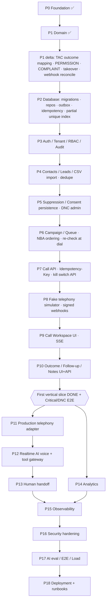

# IMPLEMENTATION_PLAN

実装状態は `PROGRESS.md` が Single Source of Truth。本書は「何を・どの順で・何が満たされたら Done か」を定義する。

## Task Graph（依存関係）

上位ノードは下位ノードが **Done** になるまで着手しない。

```text
[P0] Foundation (tooling / config+flags / error taxonomy / PII-safe logging / health / CI)
  │
[P1] Domain (pure, framework-free)
  ├─ Phone normalization (JP → E.164)
  ├─ Suppression policy (DNC, fail-closed)
  ├─ Calling window (JST, 迷惑時間)
  ├─ Call state machine
  ├─ Outbound guard pipeline  ← depends on all of the above
  ├─ Outcome → Follow-up / DNC
  └─ Conversation state machine + stop-intent detection (AI 前提の安全ロジック)
  │
[P2] Database (PostgreSQL 16, migrations, repositories, outbox, idempotency table)
  │
[P3] Authentication / Tenant / RBAC
  │
[P4] Contacts / Leads (CSV import ← テレアポ管理シート.csv 互換)
  │
[P5] Suppression / Compliance (persisted DNC, audit, cross-campaign)
  │
[P6] Campaign / Queue (concurrency, per-contact lock)
  │
[P7] Call domain persistence + POST /calls (Idempotency-Key)
  │
[P8] Mock Telephony (FakeTelephonyProvider: ring/answer/busy/reject/timeout/voicemail/
  │                  provider error/duplicate/delayed/out-of-order webhook)
  │
[P9] Call Workspace (UI, keyboard-first)
  │
[P10] Outcome / Follow-up (API + UI)          ← 最初の Vertical Slice 完成点
  │
[P11] Production Telephony (adapter; 公式Docs確認後)
  │
[P12] Realtime AI Voice (adapter; 公式Docs確認後, AI_VOICE_ENABLED=false 既定)
  │
[P13] Human Handoff
  │
[P14] Analytics → [P15] Observability → [P16] Security Hardening
  │
[P17] AI Evaluation / E2E / Load → [P18] Production Deployment
```

### 最初の Vertical Slice

```text
Contact → Phone normalization → Suppression check → Call request → Mock Telephony
→ Call lifecycle → Outcome → Follow-up
```

P1 で Domain、P2–P8 で API/DB、P9–P10 で UI と E2E を通し、この Slice を **UI/API/DB/Test** まで完成させる。

---

## Phase 0 — Foundation（Specification）

### Goal

後続 Phase が「安全に・テストを信用して」積み上げられる最小基盤を作る。業務機能は含まない。

### User stories

- 開発者として、`npm ci && npm run verify` 一発で format/lint/typecheck/test/build の合否を知りたい。
- 運用者として、設定ミス（不正な env）では **起動しない** でほしい（fail fast）。
- 運用者として、`AUTO_DIAL_ENABLED` などの危険なフラグは明示しない限り OFF であってほしい。
- SRE として、全リクエストに `requestId` が付与され、レスポンスとログで相関できてほしい。
- Security として、ログに電話番号全文・トークン・会話全文が出ないことを保証したい。

### Domain rules

- エラーは固定の taxonomy（`ErrorCode`）で表現し、各コードは **retryable か否か** を持つ。
  `CONTACT_SUPPRESSED` / `INVALID_STATE_TRANSITION` / 認可系は **retry 禁止**。
- Feature flags（`AI_VOICE_ENABLED`, `AUTO_DIAL_ENABLED`, `RECORDING_ENABLED`, `HUMAN_HANDOFF_ENABLED`）は既定 `false`。
- `OUTBOUND_KILL_SWITCH` は既定 **ON（発信停止）**。発信基盤（P7 以降）が完成し運用者が明示的に解除するまで発信不可。
- `WEBHOOK_SIGNATURE_BYPASS=true` は `NODE_ENV=production` では起動拒否。
- 秘密値は client-safe config に絶対に含めない。

### Acceptance criteria

1. `loadConfig(env)` は不正な値で `ConfigError` を投げ、どのキーが不正かを返す（値そのものは返さない）。
2. `loadConfig({})`（最小構成）で全 feature flag が `false`、kill switch が `true`。
3. production で bypass フラグが立つと起動拒否。
4. `toClientSafeConfig()` の出力に secret 系キーが含まれない。
5. `redact()` は電話番号（国内/E.164/ハイフン有無）・メール・トークン系キー・transcript 系キーをマスクする。
6. `GET /health` が 200 と `x-request-id` を返す。受信した妥当な `x-request-id` は引き継ぐ。
7. 未知ルートは taxonomy 形式 `{ error: { code: 'NOT_FOUND', requestId } }` で 404。
8. GitHub Actions で `verify` が走る。

### Failure cases

- `PORT=abc`、`NODE_ENV=staging-ish` → 起動拒否。
- 悪意ある `x-request-id`（改行・長大文字列）→ 採用せず新規発行（ログインジェクション防止）。
- ハンドラ内の想定外例外 → 500 `INTERNAL_ERROR`、スタックや内部メッセージはレスポンスに出さない。

### Security considerations

- ログインジェクション（request id 検証）、PII redaction、エラーメッセージからの情報漏洩、production での署名検証バイパス禁止。

### Tests required

- `src/domain/errors.test.ts`（taxonomy / retryable 分類）
- `src/infrastructure/config.test.ts`
- `src/infrastructure/logging/redact.test.ts`
- `src/interface/http/app.test.ts`（Fastify `inject` を使った HTTP レベル）

### Files expected to change

`package.json`, `tsconfig*.json`, `eslint.config.js`, `vitest.config.ts`, `src/domain/errors.ts`,
`src/infrastructure/config.ts`, `src/infrastructure/logging/*`, `src/interface/http/app.ts`, `src/main.ts`,
`.github/workflows/sales-engagement-platform.yml`, `docs/*`

### Definition of Done

- 上記テストがすべて RED を経て GREEN。
- `npm run verify` PASS（format / lint / typecheck / coverage threshold / build）。
- `PROGRESS.md` 更新、判断は `DECISIONS.md` に ADR として記録。

---

## Phase 1 — Domain（Specification）

### Goal

発信の安全性を決める中核ロジックを **フレームワーク非依存の純関数** として完成させる。I/O は一切持たない。

### User stories

- 営業として、DNC 登録された顧客には **どの経路からも** 電話がかからないことを信頼したい。
- 管理者として、迷惑時間帯（既定 9:00 前 / 20:00 以降 JST）の発信を機械的に止めたい。
- 開発者として、Call の不正な状態遷移（例: `COMPLETED → RINGING`）がドメインエラーになってほしい。
- 営業として、通話結果を記録したら次アクション（Follow-up）が自動で決まってほしい。
- コンプライアンスとして、顧客が「もう電話しないで」と言ったら AI が説得を続けず終話してほしい。

### Domain rules

- **電話番号**: 日本国内番号を E.164（`+81…`）へ正規化。全角数字・ハイフン・括弧・空白を許容。桁数不正・国外番号は `VALIDATION_ERROR`。
  110/119 等の特番・`0120`/`0800`（着信課金）・`0570`・`0990` は発信対象外として拒否。
- **Suppression**: 判定は `ALLOW` / `BLOCK` / `HUMAN_REVIEW`。判定不能（lookup 失敗・データ欠損）は **fail closed**（`BLOCK`）。
  DNC は tenant 全体に効き、campaign を跨いで有効。期限付き suppression は期限切れ後のみ解除。
- **Calling window**: tenant のタイムゾーン（既定 Asia/Tokyo）で評価。日曜・祝日除外は設定で選択。顧客の「電話可能な時間帯」が分かっていればその窓と AND をとる。
- **Call state machine**: 許可遷移表に無い遷移は `INVALID_STATE_TRANSITION`。終端（`COMPLETED/FAILED/CANCELLED`）からは遷移不可。
- **Guard pipeline**: 仕様 13 の順に評価し、最初の失敗で停止。どの guard が例外を投げても fail closed。
- **Safety state 優先**: `DO_NOT_CALL / STOP_REQUESTED / LEGAL_BLOCK / PRIVACY_BLOCK` はあらゆる outcome・conversion 判定より優先。
- **Outcome**: 「拒否（再勧誘拒否）」は DNC 化し follow-up を作らない（宅建業法施行規則 16条の11 の再勧誘禁止を想定）。

### Acceptance criteria / Tests required

`src/domain/**.test.ts` に以下の振る舞いテスト。DNC 系テストを最重要として独立 describe にまとめる。

### Definition of Done

- Domain coverage: branches ≥ 95%、lint で Domain から外側レイヤ/ Node API の import を禁止。
- Mutation 観点の自己レビュー（suppression 判定の反転を検出できるテストがあるか）を `TESTING.md` に記録。

---

## Phase 2 — Database（Specification, 次に着手）

### Goal

Phase 1 の判断に必要な事実を PostgreSQL 16 に永続化し、DNC が再起動・再試行を越えて残ることを保証する。

### Scope

- migration ツール: 素の SQL ファイル（`migrations/NNNN_*.sql`）+ 小さな runner（適用済み記録テーブル、forward-only、checksum 検証）。ORM は導入しない（ADR を追加）。
- テーブル: `organizations`, `users`, `memberships`, `contacts`(phone_e164, organization_id, unique), `suppressions`, `campaigns`, `calls`(state, version), `call_events`, `idempotency_keys`, `outbox_events`, `follow_ups`。
- index: `(organization_id, phone_e164)`, `suppressions(organization_id, phone_e164)`, `calls(organization_id, contact_id, state)`, `calls(campaign_id, created_at)`, `follow_ups(organization_id, due_at)`, `outbox_events(published_at NULLS FIRST, id)`。
- Repository は application 層の port（interface）+ infrastructure 実装。

### Acceptance criteria

- 実 PostgreSQL に対する integration test（CI は service container、ローカルは `/usr/lib/postgresql/16`）。
- DNC を書いた後に新しい接続プール（=再起動相当）から読んでも BLOCK。
- `idempotency_keys` の一意制約で同一 key の同時 100 リクエストが 1 件だけ NEW になる。
- 同一 contact への同時発信要求で 1 件だけ ALLOW（`SELECT … FOR UPDATE`）。
- migration の再実行は no-op、適用済みファイルの改変は checksum 不一致で失敗。

### Definition of Done

上記 + `npm run verify` + CI に migration check を追加。

---

## Implementation Task Graph（STEP 14, Mermaid, 2026-10-05）



## Phase 1 delta（新仕様・既存 TAC 監査から追加, Specification）

### Goal

2026-10-05 の要件と TAC 実ソース監査で判明した不足を Domain に追加する（純関数のみ）。

### User stories / Domain rules

1. 現行 TAC の 5 ボタン（成約/検討/折り返し/不在/拒否）をそのまま使える。`mapTacDisposition()` が CallOutcome に写像し、拒否は DO_NOT_CALL。未知ラベルは VALIDATION_ERROR（推測で写像しない）。
2. TAC のフォロー分類（再調整希望/日程返答待ち/不在/要確認/連絡停止）を取り込める。連絡停止は STOP_REQUESTED suppression、要確認は HUMAN_REVIEW、残りは callable。
3. 会話に PERMISSION 状態（DISCLOSURE → PERMISSION → IDENTIFICATION）。
4. COMPLAINT（クレーム）検知で AI は停止し人へ（STOPPING ではなく HANDOFF、ただし営業継続は不可）。
5. Human takeover 後は AI が発話できない（`canAiSpeak`）。
6. Provider webhook の重複・順序逆転は call state を壊さない（`reconcileProviderEvent`: 後退・同値は no-op）。

### Acceptance criteria / Tests

上記各項目に RED → GREEN のテスト。critical mutant に追加（拒否→DNC 写像、takeover 後の AI 発話、後退イベント無視）。

### Definition of Done

`npm run verify` + `npm run test:mutation` 全 kill、DOMAIN.md 更新。

## Phase 0 delta — Production safety limits in config（STEP 15, Specification）

### Goal

仕様 35 の安全上限（最大通話時間・日次上限・同時通話数・電話/AI 予算・発信時間帯・circuit breaker 閾値）を、**検証済みの設定値**として起動時に確定させる。現行 TAC の R4（既定 OFF / `0 = 無制限`）を構造的に再現させない。

### User stories

- 運用者として、設定を書き忘れても「無制限」にはならず、安全側の既定値で動いてほしい。
- 運用者として、矛盾した設定（開始 ≥ 終了、上限 0）では起動しないでほしい。

### Domain rules

- 日次上限・同時通話数・最大通話時間は **1 以上の有限値**。`0 = 無制限` は存在しない。
- 予算は既定 0 円 = 未設定。guard `BUDGET` は残額不足として発信を拒否する（fail closed）。
- 発信時間帯は `0 ≤ start < end ≤ 24`。既定 9–20（`DEFAULT_CALLING_POLICY` と一致させる）。

### Acceptance criteria

1. `loadConfig({})` の `limits` が既定値になる（maxCallDurationSeconds 900, dailyCallLimit 100, maxConcurrentCalls 1, telephonyBudgetYenPerDay 0, aiBudgetYenPerDay 0, callingHours 9–20, providerFailureThreshold 5）。
2. `DAILY_CALL_LIMIT=0`、負数、非整数、上限超過は ConfigError（キー名のみ報告）。
3. `CALLING_HOURS_START >= CALLING_HOURS_END` は ConfigError。
4. `limits` は client-safe 投影に含めない（運用値の露出を最小化）。

### Failure cases

`MAX_CALL_DURATION_SECONDS=abc` / `=99999`、`MAX_CONCURRENT_CALLS=0`、`CALLING_HOURS_END=25`。

### Security considerations

上限値は攻撃面（コスト暴走 T7）への防御。ブラウザには出さない。

### Tests / Files

`src/infrastructure/config.test.ts`、`src/infrastructure/config.ts`、README の env 表。

### Definition of Done

RED → GREEN → REFACTOR、`npm run verify` PASS、PROGRESS 更新。
